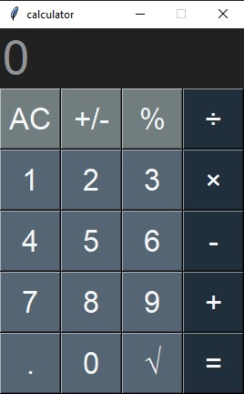

# Python Tkinter Calculator

This project is a graphical calculator built using **Python** and the **Tkinter** library. It features a clean, modern interface and well-structured code, making it suitable both for learning GUI programming and for practical use.

## Features

* Basic arithmetic operations (addition, subtraction, multiplication, division)
* Clean output formatting (removes unnecessary trailing decimals)
* Sign toggle (+/-)
* Percentage calculation
* Modern color-themed interface
* Automatic window centering
* Dynamically generated buttons for cleaner and scalable code

## How This Program Works

The calculator operates using an **event-driven** approach. Every button press triggers a function that updates the display, stores the operator, or performs the final calculation.

When an operator such as `+` or `×` is selected, the current value is stored as the first number, and the next input starts fresh from zero. When the `=` button is pressed, the stored values are processed and the result is displayed.

Helper functions manage tasks like formatting numbers, toggling signs, and producing clean, readable results.

## Technologies Used

* Python
* Tkinter

## How to Run

1. Clone the repository:

```bash
git clone https://github.com/ghazal1383ab/Python-Tkinter-Calculator-App
```

2. Navigate into the project folder:

```bash
cd Python-Tkinter-Calculator-App
```

3. Run the program:

```bash
python calculator.py
```

## Contributions

Contributions, suggestions, and issue reports are welcome.


<p align="center">
  
</p>


